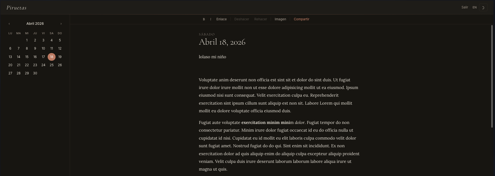
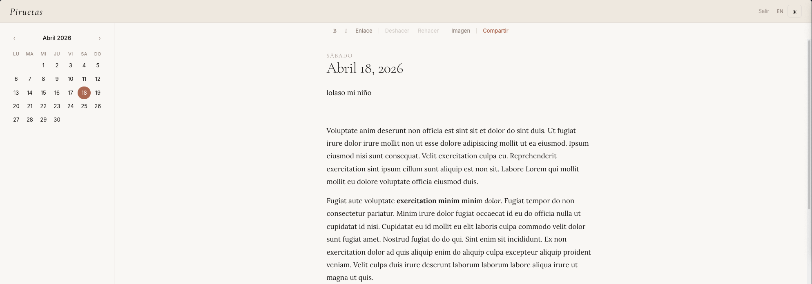

# <p align="center"></p>

# Piruetas

A minimalistic, self-hosted diary and journaling web app.

Piruetas gives each day its own page with a clean writing experience, multi-user support, and full control over your data.

## Try it

A live demo is available at [piruetas.patilla.es](https://piruetas.patilla.es).
Log in with **demo** / **mysupersecretpassword** — content resets every 30 minutes.

| Dark | Light |
|------|-------|
|  |  |

## Features

- Day-per-page diary with month calendar navigation
- Rich text editing (bold, italic, links, inline images) via Tiptap
- Auto-save with 2-second debounce and "Saved" toast
- Drag-and-drop image uploads (JPEG, PNG, GIF, WebP, max 10 MB)
- Public entry sharing via unique link
- Multi-user with admin panel (create, delete, reset passwords)
- English and Spanish UI (locale switcher in header, cookie-persisted)
- Configurable calendar week start (Monday or Sunday)
- Light and dark theme (persisted in localStorage)
- Mobile responsive with bottom toolbar above keyboard
- Docker deployable with CI/CD via Forgejo

## Quick start (Docker)

```bash
git clone ssh://git@forgejo.patilla.es:2223/patillacode/piruetas.git
cd piruetas
cp .env.example .env
# Edit .env — set SECRET_KEY, ADMIN_USERNAME, ADMIN_PASSWORD
docker compose up -d
```

Open `http://localhost:8000` and log in with your admin credentials.

## Local development

Requirements: Python 3.12+, [uv](https://docs.astral.sh/uv/), [just](https://just.systems/).

```bash
git clone ssh://git@forgejo.patilla.es:2223/patillacode/piruetas.git
cd piruetas
cp .env.example .env
# Edit .env: set SECRET_KEY to any string, set SECURE_COOKIES=false
just install
just dev
```

Open `http://localhost:8000`.

## Just commands

| Command | Description |
|---|---|
| `just install` | Create virtualenv and install dependencies |
| `just dev` | Run development server with hot reload |
| `just test` | Run test suite |
| `just lint` | Lint with ruff |
| `just format` | Format with ruff |
| `just fix` | Auto-fix lint issues and format in one pass |
| `just docker-build` | Build Docker image locally |
| `just docker-run` | Run in Docker with env file and data volume |
| `just compose-up` / `just compose-down` | Docker Compose up / down |
| `just seed-admin` | Create admin user from env vars (idempotent) |
| `just db-shell` | Open SQLite shell |
| `just release 1.2.3` | Tag and push a release |

## Configuration

| Variable | Default | Description |
|---|---|---|
| `SECRET_KEY` | — | Required. Random string for session signing |
| `ADMIN_USERNAME` | `admin` | Admin username (seeded at startup) |
| `ADMIN_PASSWORD` | `changeme` | Admin password — change this! |
| `DATABASE_URL` | `sqlite:////data/piruetas.db` | SQLite database path |
| `DATA_DIR` | `/data` | Directory for database and image uploads |
| `PORT` | `8000` | Port to listen on |
| `SECURE_COOKIES` | `true` | Set to `false` for local dev without HTTPS |
| `WEEK_START` | `monday` | Calendar week start: `monday` or `sunday` |
| `DEMO_ENABLED` | `false` | Enable demo user and periodic content reset |
| `DEMO_USERNAME` | `demo` | Demo account username |
| `DEMO_PASSWORD` | `demo` | Demo account password |
| `DEMO_RESET_INTERVAL` | `1800` | Seconds between demo content wipes |

## Updating (Docker)

```bash
docker compose pull
docker compose up -d
```

## Tech stack

Python 3.12, FastAPI, SQLite, SQLModel, Tiptap, Jinja2, itsdangerous
