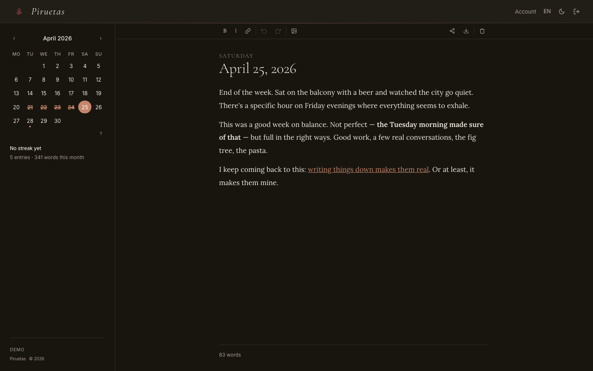
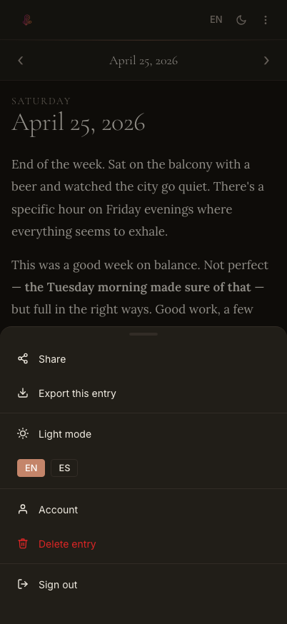
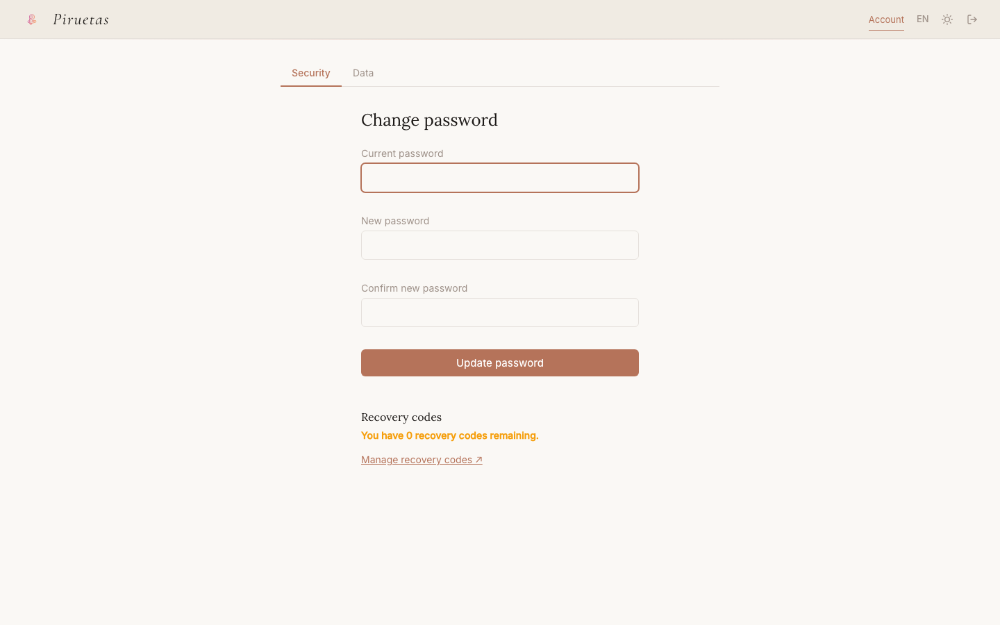

# <p align="center"></p>

# Piruetas

A minimalistic, self-hosted diary and journaling web app.

Piruetas gives each day its own page with a clean writing experience, multi-user support, and full control over your data.

## Try it

A live demo is available at [piruet.app](https://piruet.app).
Log in with **`demo`** / **`piruetas`**, content resets every 30 minutes.

| Editor | Mobile menu | Account |
|--------|-------------|---------|
|  |  |  |

[More screenshots →](app/static/img/screenshots/)

## Features

- Day-per-page diary with month calendar navigation
- Rich text editing (bold, italic, links, inline images) via Tiptap
- Auto-save with 2-second debounce and "Saved" toast
- Drag-and-drop image uploads (JPEG, PNG, GIF, WebP, max 10 MB)
- Public entry sharing via unique link (with revocation)
- Multi-user with admin panel (create, delete, reset passwords)
- English and Spanish UI (locale switcher in header, cookie-persisted)
- Configurable calendar week start (Monday or Sunday)
- Light and dark theme (persisted in localStorage)
- Mobile responsive with bottom toolbar above keyboard
- Docker deployable with CI/CD via Forgejo

## Quick start (Docker)

Create a `compose.yml`:

```yaml
services:
  piruetas:
    image: forgejo.patilla.es/patillacode/piruetas:latest
    ports:
      - "8000:8000"
    volumes:
      - ./data:/data
    environment:
      # generate with: openssl rand -hex 32
      SECRET_KEY: change-me-to-a-random-string
      ADMIN_USERNAME: admin
      ADMIN_PASSWORD: changeme
      SECURE_COOKIES: "false"        # set to "true" if serving over HTTPS
      REGISTRATION_OPEN: "false"     # set to "true" to allow self-registration
      # TRUST_PROXY: "true"          # uncomment if behind a reverse proxy (nginx, Caddy, Traefik)
    restart: unless-stopped
```

```bash
docker compose up -d
```

Open `http://localhost:8000` and log in with your admin credentials.

To update: `docker compose pull && docker compose up -d`

## Local development

Requirements: Python 3.12+, [uv](https://docs.astral.sh/uv/), [just](https://just.systems/).

```bash
git clone ssh://git@forgejo.patilla.es:2223/patillacode/piruetas.git
cd piruetas
cp .env.example .env
# Edit .env: set SECRET_KEY to any string, set SECURE_COOKIES=false
just install
just dev
```

Open `http://localhost:8000`.

Run `just` to see all available recipes.

### JS bundle

The Tiptap editor library is bundled from npm into `app/static/js/vendor/tiptap.bundle.js` using esbuild. This file is committed to the repo so no Node tooling is needed to run the app — it's treated as a vendored asset, the same as self-hosted font files.

To rebuild after upgrading Tiptap (bump versions in `package.json` first):

```bash
just build-js
```

The Docker build always rebuilds the bundle from source in a Node build stage, so the committed bundle is only used for local development without Docker.

### Running tests

Unit and integration tests (no browser required):

```bash
just test
```

E2E tests with Playwright (one-time browser install needed first):

```bash
just install-e2e   # downloads Chromium and Firefox — run once
just test-e2e      # headless
just test-e2e-headed  # with visible browser (useful for debugging)
```

## Configuration

See [CONFIGURATION.md](CONFIGURATION.md) for all available environment variables.

## Support

Piruetas is free and open source. If you find it useful, a small donation keeps it alive.

[](https://ko-fi.com/patillacode)

## License

Piruetas is licensed under the [GNU Affero General Public License v3.0](LICENSE) (AGPL-3.0).

For use in proprietary or commercial products without complying with the AGPL-3.0, a commercial license is available. See [COMMERCIAL_LICENSE.md](COMMERCIAL_LICENSE.md) or contact patillacode@gmail.com.
